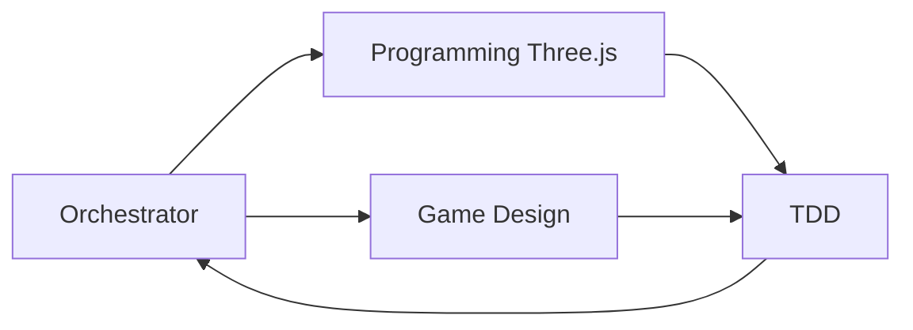

# Ikarus Eternal Horizon — Planning Spec (SDD Hub)

#tag/arch
#tag/poc
#tag/refactor
#tag/managers
#tag/scenes
#tag/layers
#tag/memory
#tag/ship #tag/weapons #tag/resources #tag/equipment
#tag/enemies #tag/asteroids #tag/energy #tag/hud #tag/controls
#tag/difficulty #tag/ranking #tag/survivor #tag/craft
#tag/g0 #tag/g1 #tag/g2 #tag/g3

**Version:** 4.3.0 · **Status:** active (POC2 SDD hub — multi-agent, TDD-backed)
**Purpose:** the single planning document for **POC2** (`poc2/`). It transposes the design from [`README.md`](../../README.md) (public GDD) and the architecture contract from [`phase-0-poc2.md`](../phases/phase-0-poc2.md). Organized **by subject** and in **logical build order**, ready to generate per-subject SDD+TDD specs (`.docs/specs/{subject}.spec.ts`) and the backlog in [`poc2/todo.md`](../../poc2/todo.md). **POC-1 (`poc/`) is frozen and is not planned here** — it is cited only as a behavior/tuning reference.
**Sources:** README.md · [`phase-0-poc2.md`](../phases/phase-0-poc2.md) · poc/README.md (frozen feel reference only)
**Supersedes:** hub v4.2.0.

**What changed in 4.3.0:**
- **Four control schemes** ship as `D19` (closes Q07 as: mouse **buttons/wheel** in; **pointer-steer** still deferred). Keyboard (POC-1) · Gamepad API (`D18`) · WASD + mouse · touch overlay with **nipplejs** (`G12`). No mode toggle. `C02` stays device-blind; `A02` merges sources.
- Combat vocabulary: move, fire, bomb, switch weapon, switch bomb, dash, pause. Dash input is G0; Energy drain stays `SHIP-08`.
- `BALANCE.controls.mouse` / `.touch` / `.dash` and extra gameplay keys added to A01.

**What changed in 4.2.0:**
- **Gamepad API + dual-rumble haptics** ship in POC2 (`D18`). `SDD-A02` polls `navigator.getGamepads()`, maps the W3C standard layout, and owns `rumble()`. Persistent remap stays G3 (`SHIP-13`).
- `BALANCE.controls.gamepad` and `BALANCE.haptics` added to A01. C02 reads analog axes; E07 reads the fire trigger; F04/F05 call haptic presets.

**What changed in 4.1.0:**
- This hub is **POC2-only**. POC-1 is a frozen reference, not a workstream.
- New **§6.3 Multi-agent SDD** — four named agents (Orchestrator, Programming/Three.js, Game Design, TDD) own distinct sections of every spec; implementation is gated on all four sign-offs.
- Spec template is SDD **and** TDD: contract first, failing tests second, code third (`D17`).
- Every Stage A–G card now has a filled `.docs/specs/{subject}.spec.ts`.

**What changed in 4.0.0** (read this if you knew v3):
- New **§0** separates *as-built POC-1* from *target POC2* — v3 described the target tree as if it already existed.
- New **§5.0 port map**: every POC-1 file is assigned to a target card with an explicit change type.
- **§3.5** is now the real enumerated requirement index (v3 listed only ID prefixes).
- **8 missing cards added**: `B04` Gizmos, `C03` ShipHealth, `D04`–`D06` Plasma/Beam/Mjolnir, `F04` DamageResolver, `F05` VfxManager, `G10` RunState+Score, `G11` Pause+Inventory. The playable pillar named *shield→integrity risk · die · restart* had no card covering it.
- **Q01–Q06 closed** as decisions `D11`–`D16`; SDD generation is no longer blocked.
- New **§6.1 Definition of Done** and **§6.2 task generation**; new **§10 build-order graph**.

---

## 0. Reality check — POC-1 as built vs POC2 target

The scope below is a **build order for POC2 (`poc2/`)**, a new project. POC-1 (`poc/`) is **frozen** and serves as the playable behavior reference: the tuned feel of camera, parallax, limit-box, ship motion and laser must be reproduced **without behavior change**.

| Concern | POC-1 as built (`poc/src`, 30 files, ~3.6k lines) | POC2 contract (this hub) |
|---|---|---|
| Composition | 100% factory functions (`createShip()`, `createWeapon()`) — zero `export class` | `interface` + `class` + module (pattern constructor, §4) |
| Three.js | Composition only — no `extends THREE.*` anywhere | Domain classes inherit their THREE base (§4) |
| Files | flat `camelCase.ts` in `core/gameobjects/systems/weapons` | `kebab-case.ts`, folder per domain (§4) |
| Pooling | one `ShotPool` embedded in `gameobjects/shot.ts` | generic `ObjectPool<T>` in `pools/` (`A05`) |
| Loop | `requestAnimationFrame` inlined in `main.ts` (179 lines) | `GameLoop` class in `core/loop.ts` (`A04`) |
| Math | inline per module; no `core/math.ts` | `core/math.ts` with scratch vectors (`A03`) |
| Screens | none — a single always-running scene | `SceneController` + 5 scenes (`G01`–`G05`, `G11`) |
| Damage | none — `testTarget.ts` only validates hits | `ShipHealth` + `DamageResolver` (`C03`, `F04`) |
| Score / run end | none | `RunState` + `ScoreManager` (`G10`) |
| Verification | no tests, no lint | `typecheck` + `lint` + `test` gate the DoD (§6.1) |

**Already solved in POC-1 and only being ported** (do not re-design): balancer, input with Shift combos, camera rig, 3-layer parallax with `parallaxGain`, limit-box with bounce + auto-recenter, ship with tilt/bank, force-based motion, pooled shots with distance decay, **all four weapons** (Laser/Plasma/Beam/Mjolnir), laser levels L1–L10, energy pool, layered collision with AoE, debugger panel with live two-way sync.

---

## 1. Game card

| Field | Value |
|---|---|
| **Title** | Ikarus: Eternal Horizon |
| **Genre** | Shooter roguelite / arcade shmup, 2.5D |
| **Perspective** | 3D rendering with **two-axis (X/Y) gameplay** — depth (Z) is visual only |
| **Stack** | TypeScript · Vite · **Three.js** (graphics/layers) · **Yuka** (logic/AI) · **Howler** (audio) · **HTML/CSS** (menus) — see §4.1 |
| **Session** | Short, intense runs; endless, no fixed ending; difficulty scales progressively |
| **Modes** | **Normal** (full systems) · **Survivor** (one-shot from scratch) — both SDD-ready later (§7) |
| **Platforms** | Web (Itch.io) → PC (Steam) |
| **Playable pillar** | move on X/Y · fire laser · shield→integrity risk · collect · die · restart, immediately wanting another run |

## 2. Design pillars & run loop

**Pillars** (carried from the GDD):
1. **Visible risk, instant decision** — state (Force Field / Integrity / Energy) always readable.
2. **Tangible degradation, never binary punishment** — losing the shield changes the phase of play.
3. **Progression without dead time** — craft chosen on pause; construction runs in real time (1 slot).
4. **Legibility at high speed** — silhouette + color read the threat in <0.3s.
5. **"One more kill" loop** — the run ends only on death; the goal is the next milestone.
6. **Leaderboards as meta** — week/month/year/eternal boards.

**Run loop (roguelite):** spawn pressure → shoot/move → absorb damage on Force Field → drops/collection → progressive difficulty → death returns a result → rankings → next run. Milestones scale with kill count (50 mini-boss / 100 mega asteroid / 500 boss; past 500 scales patterns, not just numbers).

**Pillar → card coverage** (every pillar must be owned by a card; this closed the v3 gap):

| Pillar fragment | Owning cards |
|---|---|
| move on X/Y | `A02` `C01` `C02` `B03` |
| fire laser | `A05` `D01` `D02` `D03` `E07` |
| shield→integrity risk | **`C03`** **`F04`** `F01` `G07` |
| collect | `F02` `C01` (inventory) |
| die · restart | **`G10`** `G01` `G04` |
| pressure that escalates | `E01` `E02` `E05` `E06` `F03` |
| readable at speed | `F05` `G07` `G09` |

## 3. Canonical nomenclature

Terms are canonical for all docs, specs and code. Divergence = documentation bug. PT shown for parity with legacy docs; **EN is the code/doc language from this phase on** — this includes `poc2/`, all `README`s and all specs.

### 3.1 Ship
| EN | PT (legacy) | Rule |
|---|---|---|
| Hull Integrity (Hull) | Integridade | 0 ends the run; no self-regen |
| Force Field (Shield) | Campo de Força | absorbs all damage until zero; slow passive regen |
| Speed | Velocidade | agility in X/Y |
| Energy | Energia | fuel for weapons, jets, craft |
| Inventory | Inventário | resources + equipment (model unchanged) |

### 3.2 Combat
| EN | PT | Rule |
|---|---|---|
| **Laser** · **Plasma** · **Beam** · **Mjolnir** | Armas principais | all four defined; profile-per-weapon spec (`D02`, `D04`–`D06`) |
| Special Ordnance (Pulse Nova · Swarm Torpedo · Star Killer) | Bombas | fired from bombs (§7) |

### 3.3 Resources
| EN | PT | Use |
|---|---|---|
| Metal Scrap · Prismatic Crystal · Dense Core · Dark Matter · Equipment | Metal Scrap … | drops → inventory (`F02`; full table §7) |

### 3.4 Run progression
| Kills | Event |
|---|---|
| 50 / 100 / 500 | MiniBoss / Mega Asteroid / Boss General + wave; past 500 = pattern scaling |

### 3.5 Requirement index (traceability)

IDs are **stable and never renumbered**. Origin of the definitions is `.docs/plans-later/*.spec.MD` (Portuguese legacy); the English statement below is canonical from this version on. `Card` names the SDD subject that satisfies the requirement — `§7` means the requirement is declared but not yet planned in detail.

**`SHIP-` — ship, energy, inventory, controls** (`spaceship-plan.spec.MD`)

| ID | Gate | Prio | Requirement | Acceptance | Card |
|---|---|---|---|---|---|
| `SHIP-01` | G0 | must | Ship game object with X/Y motion and light inertia | Moves inside playfield bounds, never leaves the frame | `C01` `C02` |
| `SHIP-02` | G0 | must | Simple Integrity + destruction | Enough damage ends the run | `C03` `G10` |
| `SHIP-03` | G0 | must | Laser fire wired to the projectile pool | Shots leave the ship and remove enemies | `D01` `D02` `E07` |
| `SHIP-04` | G0 | should | Alternative pointer control | Mouse **buttons** fire/bomb/switch without breaking the keyboard. Mouse **position** does not steer (pointer-steer deferred). | `A02` `C02` `G12` (`D19`) |
| `SHIP-05` | G1 | must | Force Field absorbs before Integrity | Shield bar drains first; hull only after it hits zero | `C03` |
| `SHIP-06` | G1 | must | Minimal inventory with Metal Scrap | Collected resource shows in the UI | `C01` `F02` `G11` |
| `SHIP-07` | G1 | must | Repair in the CraftSlot consuming Metal Scrap | Integrity rises when the craft completes | §7 craft |
| `SHIP-08` | G1 | should | Jet with its own Energy reserve | Boost drains and recharges when idle | §7 (`C02` `D03` seam). **Dash input** is `D19` / C02 now |
| `SHIP-09` | G2 | must | Full Energy economy (weapons, jets, craft) | Actions drain Energy per config | `D03` |
| `SHIP-10` | G2 | must | Equipment slots applying effects | Equipping changes the matching attribute | §7 `EQP-` |
| `SHIP-11` | G2 | must | Tech tree with the 3 branches | Spent points change run stats | §7 |
| `SHIP-12` | G2 | must | Hull damage levels applying penalties | Level 1/2/3 degrades motion and fire | `C03` |
| `SHIP-13` | G3 | must | Persistent gamepad remap + Steam Input | Remap survives restart; Steam Deck checklist | §7 remap. **POC2 play** = `A02` `C02` `E07` (`D18`) |

**`WPN-` — weapons and shots** (`weapons-plan.spec.MD`)

| ID | Gate | Prio | Requirement | Acceptance | Card |
|---|---|---|---|---|---|
| `WPN-01` | G0 | must | Laser with pooled projectiles and stable cadence | Shots recycle from the pool; zero allocation per shot | `A05` `D01` `D02` |
| `WPN-02` | G0 | must | Projectile × enemy collision applying damage | Enemy dies once damage accumulates | `F01` `F04` |
| `WPN-03` | G1 | should | Second playable weapon + switch input | Switching works without stalling fire | `D04` `E07` |
| `WPN-04` | G2 | must | Full arsenal (Laser, Plasma, Beam, Mjolnir) | All four available and distinct in play | `D02` `D04` `D05` `D06` |
| `WPN-05` | G2 | must | Energy cost per weapon per config | Energy drops per shot/second and blocks fire at 0 | `D03` `E07` |
| `WPN-06` | G2 | must | Special Ordnance (3 types) with limited charges | Each special performs the described effect | §7 bomb |
| `WPN-07` | G2 | must | Weapon upgrades via equipment | Equipping visibly changes weapon behavior | §7 `EQP-` |
| `WPN-08` | G2 | should | Crit and cadence affected by Weaponry | Skills change measured DPS | §7 skills |

**`ENM-` — enemies, asteroids, bosses** (`enemys-plan.spec.MD`)

| ID | Gate | Prio | Requirement | Acceptance | Card |
|---|---|---|---|---|---|
| `ENM-01` | G0 | must | One generic enemy with continuous spawn | Enters, collides, despawns off-field | `E01` `E05` |
| `ENM-02` | G0 | must | Enemies pooled | Long spawn sessions do not grow the heap | `A05` `E05` |
| `ENM-03` | G1 | must | Two distinct behaviors, or 1 + MiniBoss@50 | The player tells the threats apart | §7 (`E05` seam) |
| `ENM-04` | G1 | must | Asteroids with collision and drop | Destroying one yields fragments | `E02` `E06` `F02` |
| `ENM-05` | G1 | should | MiniBoss telegraph (edge marker + audio) | Warning fires before it enters the field | §7 |
| `ENM-06` | G2 | must | Full trio, silhouette legible <0.3s | Playtester names the archetype under pressure | §7 |
| `ENM-07` | G2 | must | Mega Asteroid with fragmentation | Forces repositioning; pays out heavily | §7 (`E06` seam) |
| `ENM-08` | G2 | must | Boss General with phases and escort | Fight winnable with skill | §7 |
| `ENM-09` | G2 | must | Post-500 scaling with pattern variation | Later cycles change patterns, not only stats | `F03` |

**`RES-` — drops, materials, collection** (`resources-plan.spec.MD`)

| ID | Gate | Prio | Requirement | Acceptance | Card |
|---|---|---|---|---|---|
| `RES-01` | G1 | must | Metal Scrap dropping from asteroids and enemies | Fragments appear on destruction | `F02` |
| `RES-02` | G1 | must | Collection with magnet radius and feedback | Approaching pulls it in; UI and SFX confirm | `F02` `G07` |
| `RES-03` | G1 | must | Fragments pooled | A long session does not grow the heap without bound | `A05` `F02` |
| `RES-04` | G2 | must | Full table (5 types) with rarity per source | Every source respects the drop table | `F02` |
| `RES-05` | G2 | must | Stock caps per resource | Surplus is not collected, or is converted | `F02` `C01` |
| `RES-06` | G2 | should | Equipment dropping as a ready-made item | Epic loot enters the inventory | §7 |

**`RUL-` — loop, HUD, memory, packaging** (`game-rules-plan.spec.MD`)

| ID | Gate | Prio | Requirement | Acceptance | Card |
|---|---|---|---|---|---|
| `RUL-01` | G0 | must | Game loop with rAF, `dt` clamp and update→render order | Runs stable with no console errors | `A04` |
| `RUL-02` | G0 | must | Playfield bounds and off-area despawn | Nothing accumulates off-screen | `F01` `E05` `E06` `G09` |
| `RUL-03` | G0 | must | Score/kills in the HUD + game over with restart | Counters rise; death restarts | `G10` `G07` `G04` |
| `RUL-04` | G1 | must | Pause opening the menu without breaking the loop | Unpausing resumes the run and the craft | `G11` |
| `RUL-05` | G1 | must | Exclusive real-time CraftSlot | A second craft is blocked | §7 craft |
| `RUL-06` | G1 | must | Difficulty ramp by kills | End of run is clearly harder | `F03` |
| `RUL-07` | G1 | must | Persistent local best score | Survives a reload | `G10` (Q10) |
| `RUL-08` | G1 | must | Validated Itch packaging | Opens on Itch with no absolute path | `G09` |
| `RUL-09` | G2 | must | Milestones 50/100/500 + scaling | Events fire at the thresholds | `F03` |
| `RUL-10` | G2 | must | Hull levels 1–3 with penalties | Degradation perceptible per level | `C03` |
| `RUL-11` | G2 | must | Score multipliers | Skill yields a higher score | `G10` |
| `RUL-12` | G2 | must | Balance constants in a single config | No gameplay numbers inside gameplay code | `A01` |
| `RUL-13` | G2 | must | Worst case legible and frame-stable | Mega + wave with no frame drop and no confusion | `F05` `A04` `A05` |
| `RUL-14` | G3 | must | Persistent settings (audio/video/binds) | Survive restart and Cloud | §7 |

**Future prefixes:** `EQP-01..07` (equipment) · `RNK-01..09` (leaderboards) · `ACH-01..09` (achievements) · `LORE-01..09` (worldbuilding) — all §7, defined in their own `plans-later` documents.

## 4. Architecture policy

This planning **adopts** [`phase-0-poc2.md`](../phases/phase-0-poc2.md) as its architecture contract (single source for these rules):

- **Pattern constructor:** every module is `interface` + `class` + file. One concern per class, one class per file, constructor-injected dependencies. **Supersedes D03.**
- **THREE inheritance:** `Ship extends THREE.Group` (modular parts); `Enemy`/`Shot`/`Meteor` extend `THREE.Mesh`; camera mounts its `PerspectiveCamera`. Local classes import directly into the renderer.
- **Model/View by structure:** logic runs in the class; the inherited THREE base is the visual; `syncRender()` is the only bridge (reads logic → writes transforms/opacity/material).
- **Memory:** `dispose()` on every destruction; geometry/material disposed once; pooled hot paths; zero per-frame allocation.
- **Collision by layers:** who-hits-who is data (mask matrix), engine-agnostic (see Stage F).
- **Scene controller:** title → run → result → rankings → title, with pause as an overlay on the run; menus are full-page HTML/CSS that organize the three areas; the Run uses the `area-inputs · game-area · debugger-area` layout.
- **Folder tree:** the tree from phase-0-poc2 §8 is assumed (`src/core|gameobjects|systems|scenes|ui|pools|render|audio|assets`).
- **Balancer:** numbers only inside `BALANCE`; no gameplay constants in logic.

### 4.1 Engine composition (libraries per concern)

```
Engine = Three.js (Graphics/Layers) + Yuka (Logic/AI) + Howler (Audio) + HTML/CSS (Menus)
```

| Library | Concern | Applies to the SDD subjects |
|---|---|---|
| **Three.js** | Graphics & layers — meshes, materials, scene graph, camera | B01–B04, C01, D01–D02, D04–D06, E01–E03, F05, G03, G07, G09 |
| **Yuka** | Logic/AI — steering behaviors, perception, pathfinding | E01 (enemy motion), E05 (EnemyManager behaviors); extends to bosses and ranged patterns (§7). Gameplay rules (decay, energy, damage, collision layers) stay first-party TS |
| **Howler** | Audio — SFX, music, stingers, radio | HUD event triggers (G07 layer), `§7 Audio` subject |
| **HTML/CSS** | Menus & DOM areas | G02 / G04 / G05 / G11 (title, result, rankings, pause), G06 (areas), G07 (HUD overlays), G08 (debugger-area), G03 (Run layout shell), **G12 (touch overlay)** |
| **nipplejs** | Virtual analog stick (touch) | **G12** only. A02 reads a `TouchSource`; C02 never imports it |
| **— (TS stdlib)** | Pure logic — no third-party dependency | A01–A05, C02–C03, D03, E04, E06, E07, F01–F04, G01, G10 |

**Dependency staging:** `poc2` installs `three` at Stage A. **nipplejs** is added when `G12` starts. **Yuka** is added when `E01` starts; **Howler** post-G1 with the §7 Audio subject. Never install a library before the card that needs it.

Every card below names its responsible library on a **Lib:** line.

## 5. SDD subjects — module cards in build order

Cards are ordered A→G (foundation → presentation). A card must not be implemented before its **requires** list. Each card is the seed of one SDD spec (§6).

### 5.0 Port map — POC-1 file → POC2 card

Change types: **port** (move with no behavior change) · **class-ify** (same behavior, factory → `interface` + `class`) · **split** (one file becomes several cards) · **merge** (several files become one card) · **new** (no POC-1 origin) · **retire** (does not travel to POC2).

| POC-1 file (`poc/src`) | Lines | Target card | Target path (`poc2/src`) | Change |
|---|---|---|---|---|
| `core/balancer.ts` | 308 | `A01` | `core/balancer.ts` | port + type each section as an interface |
| `core/input.ts` | 46 | `A02` | `core/input.ts` | class-ify → `InputState` |
| — | — | `A03` | `core/math.ts` | **new** — extract inline math from `parallax`/`followCamera`/`shot` |
| `main.ts` (rAF block) | 179 | `A04` | `core/loop.ts` | split → `GameLoop` |
| `gameobjects/shot.ts` (pool half) | 189 | `A05` | `pools/object-pool.ts` | split → generic `ObjectPool<T>` |
| `gameobjects/cameraRig.ts` | 46 | `B01` | `gameobjects/camera/game-camera.ts` | class-ify → `GameCamera` |
| `gameobjects/parallax.ts` | 189 | `B02` | `gameobjects/parallax/` | split → `ParallaxLayer` + `ParallaxField` |
| `gameobjects/followBox.ts` + `systems/followCamera.ts` | 134 + 152 | `B03` | `gameobjects/limit-box/limit-box.ts` | merge + class-ify → `LimitBox` |
| `gameobjects/gizmos.ts` | 106 | `B04` | `gameobjects/gizmos/gizmos.ts` | class-ify (dev tool) |
| `gameobjects/ship.ts` | 111 | `C01` | `gameobjects/ship/ship.ts` | class-ify → `Ship extends THREE.Group` |
| `systems/controllers.ts` | 147 | `C02` | `gameobjects/controller/` | split → `PlayerController` + `CameraController` |
| — | — | `C03` | `gameobjects/ship/ship-health.ts` | **new** — Force Field / Integrity / degradation |
| `gameobjects/shot.ts` (shot half) | 189 | `D01` | `gameobjects/shot/weapon-shot.ts` | class-ify → `WeaponShot extends THREE.Mesh` |
| `weapons/weapon.ts` · `behaviour.ts` · `registry.ts` · `laserLevels.ts` · `behaviours/laser.ts` | 32+61+25+169+91 | `D02` | `gameobjects/weapon/` | port + class-ify (`Weapon`, `LaserBehaviour`, `laser-levels.ts`, `registry.ts`) |
| `core/weaponsCatalog.ts` | 145 | `D02` | `gameobjects/weapon/catalog.ts` | port (data only) |
| `systems/energy.ts` | 28 | `D03` | `systems/energy-manager.ts` | class-ify → `EnergyManager` |
| `weapons/behaviours/plasma.ts` | 43 | `D04` | `gameobjects/weapon/behaviours/plasma.ts` | class-ify |
| `weapons/behaviours/beam.ts` + `gameobjects/beam.ts` | 47 + 42 | `D05` | `gameobjects/weapon/behaviours/beam.ts` + `beam-visual.ts` | class-ify |
| `weapons/behaviours/mjolnir.ts` + `gameobjects/cone.ts` | 48 + 47 | `D06` | `gameobjects/weapon/behaviours/mjolnir.ts` + `cone-visual.ts` | class-ify |
| — | — | `E01` `E02` `E03` `E05` `E06` | `gameobjects/enemy/` `meteor/` `shot/enemy-shot.ts` · `systems/*-manager.ts` | **new** |
| — | — | `E04` | `systems/shot-manager.ts` | **new** — owns the pools `D01`/`E03` acquire from |
| `systems/firing.ts` | 83 | `E07` | `systems/firing-manager.ts` | class-ify → `FiringManager` |
| `systems/collisionSystem.ts` | 83 | `F01` | `systems/collision-manager.ts` + `layers.ts` | class-ify + extract the layer matrix as data |
| — | — | `F02` `F03` `F04` `F05` | `systems/drop-manager.ts` · `difficulty-manager.ts` · `damage-resolver.ts` · `vfx-manager.ts` | **new** |
| `main.ts` (composition) | 179 | `G01` `G03` | `scenes/scene-controller.ts` · `scenes/run-scene.ts` | split |
| `index.html` + `src/style.css` | 75 + 361 | `G06` `G03` | `index.html` · `ui/areas.ts` · `src/style.css` | port the three-area shell |
| `systems/energyHud.ts` + `systems/shipCoords.ts` | 57 + 46 | `G07` | `ui/hud.ts` | merge → HUD widgets + one world→screen projector |
| `systems/debugControls.ts` | 501 | `G08` | `ui/debugger/` | split one module per tab (Cam/Ship/LimitBox/Parallax/Weapons) |
| — | — | `G02` `G04` `G05` `G09` `G10` `G11` | `scenes/` · `render/renderer.ts` · `systems/run-state.ts` | **new** |
| `gameobjects/testTarget.ts` | 55 | — | — | **retire** when `E01`/`E02` land; keep in POC-1 only |

**Port rule:** a `port`/`class-ify`/`merge` card is done when POC2 reproduces POC-1's observable behavior with the same `BALANCE` numbers. Any intentional behavior change needs its own line in §9.

---

### Stage A — Core & Pools

#### `SDD-A01` Core / Balancer
- **Folder:** `src/core/balancer.ts` (module: data only, no behavior)
- **Scope:** the single source of numbers: `layout.playfield` (540×960 portrait), `weapons.catalog + loadout`, `gameplay` (fire/switch/pause/**bomb/switchBomb/dash** keys, energy start/max/regen), `controls` (shipKeys/motion/**dash**/tilt/camera/**gamepad**/**mouse**/**touch**), `ship` (transform/follow/followBox/visual/**inventory**/**health**), `camera` (fov/pos/rot/near/far), `parallax.layers[]`, `thruster`, **`difficulty`**, **`score`**, **`drops`**, **`vfx`**, **`haptics`**, **`loop`**.
- **Requires:** —
- **Lib:** — (no dependency — data-only config)
- **Design:** typed config namespace `BALANCE` (one interface per section); read-only at runtime except debugger-driven tuning slices.
- **Rules:** any gameplay number lives here; grep rule — gameplay constants outside BALANCE are a code smell.
- **Maps:** `RUL-12`, all subjects (base). **Acceptance:** every tuned number is reachable from BALANCE; no numeric literal with gameplay meaning outside it.

#### `SDD-A02` Core / Input
- **Folder:** `src/core/input.ts`
- **Scope:** central input state for **four coexisting schemes (`D19`)**: keyboard, Gamepad API, WASD + mouse buttons/wheel, and an injected `TouchSource` (G12 / nipplejs — this class never imports nipplejs). Keyboard: controlled `preventDefault` list; `blur` clears; Shift combos synthesize `Shift+KeyX`. Gamepad: poll `navigator.getGamepads()` once per `update(dt)` (W3C **standard** mapping). Mouse: buttons + wheel only — **no mousemove axis** (pointer-steer deferred). **Haptics:** `rumble(preset)` → `playEffect('dual-rumble')`. Persistent remap stays G3 (`SHIP-13`).
- **Class:** `InputState implements InputPort` — `{ update(dt); isDown(code); axis(id); isPressed(action); consumePress(action); rumble(preset); connectedPadCount; dispose() }`. Gamepad, haptic actuator and TouchSource injected for tests.
- **Requires:** A01 (gamepad + mouse + touch + haptics numbers). G12 produces TouchSource; A02 D19 follow-up can land with a zeroed stub first.
- **Lib:** — (browser **Gamepad API** + Pointer Events; no third-party pad library; no nipplejs)
- **Rules:** all four schemes coexist (no mode toggle); combos never shadow the base key; rumble no-ops when no actuator; no per-frame allocation. Axis priority: pad stick → touch stick → keyboard digital.
- **Maps:** `SHIP-01`, `SHIP-13` (POC2 play slice), `SHIP-04` (`D19`). **Acceptance:** WASD + IJKL + Shift+IJKL co-exist; left stick moves the ship; RT **or** left-click fires; a shield-hit preset rumbles when an actuator is present.

#### `SDD-A03` Core / Math
- **Folder:** `src/core/math.ts`
- **Scope:** stateless helpers: `clamp`, `lerp`, `damp`, `DEG2RAD`, `distXZ`, `decayFactor`, scratch vectors (in/out params, reuse).
- **Same as:** POC-1 `followCamera`/`controllers`/`shot`/`parallax` math extracted; pure functions, no class.
- **Requires:** —
- **Lib:** **Three.js** (Math/Vectors — scratch `Vector3` reuse; no allocation)
- **Maps:** all, `RUL-13`. **Acceptance:** exported vectors are scratch (zero allocation per frame in hot paths).

#### `SDD-A04` Core / GameLoop
- **Folder:** `src/core/loop.ts`
- **Scope:** `GameLoop` class: rAF driver, `dt` clamp (`MAX_FRAME_DT = 0.05`), one pluggable `step(dt)` per active scene; start/stop; **pause gate** (`G11`); sync-sidecar hook for debugger throttled sync (~15Hz). Does **not** poll the Gamepad API — `InputState.update(dt)` runs inside Run `step` (`G03`).
- **Requires:** —
- **Rules:** never allocates; scene stepping owns pausable runs.
- **Lib:** — (no dependency — rAF + `performance.now`)
- **Maps:** `RUL-01`, `RUL-13`, `#tag/memory`. **Acceptance:** worst-case frame (spawn burst + full field) stays frame-stable; pausing halts `step` without stopping rAF.

#### `SDD-A05` Pools / ObjectPool\<T\>
- **Folder:** `src/pools/object-pool.ts`
- **Scope:** generic `ObjectPool<T>`: `acquire(): T | null`, `release(item)`, `forEachActive(fn)`, `clear()`, `dispose()`. Release resets state and disposes per-instance resources; holder (Ship/Manager/pool) owns `scene.add/remove` so removal always pairs with disposal.
- **Requires:** —
- **Rules:** hot paths allocate zero; pooled entities are never `new`ed in updates.
- **Lib:** — (no dependency — generic TS)
- **Maps:** `WPN-01`, `ENM-02`, `RES-03`, `RUL-13`, `#tag/memory`. **Acceptance:** holding fire for 30 s shows no GC spikes; a pool exhaustion returns `null` instead of allocating.

---

### Stage B — World dressing

#### `SDD-B01` Camera
- **Folder:** `src/gameobjects/camera/`
- **Scope:** the viewing rig. `class GameCamera` — `camera: THREE.PerspectiveCamera` (`rotation.order = 'YXZ'`), `applyConfig(cfg)` for fov/aspect/near/far/position/rotation (dynamic view: `{3,14,6} / {-55,24,-14}` deg).
- **Requires:** A01, A03.
- **Lib:** **Three.js** (`PerspectiveCamera`, `Vector3`, `Euler`)
- **View:** owns the camera object; gizmos (`B04`) can read its matrices. **Rules:** framing must always show the ship's top, right side and rear.
- **Maps:** RUL render. **Acceptance:** ship visible and readable in default camera.

#### `SDD-B02` Parallax
- **Folder:** `src/gameobjects/parallax/`
- **Scope:** `class ParallaxLayer` (one per layer; 3 layers) + `class ParallaxField` (owns the set). Each layer: anchored plane grids (`gridSize`/`gridOpacity`, own orientation) + star points. Behavior: camera **Δ between frames** shifts stars opposite ∝ `parallaxGain × (1 ± jitter)`; own flight along Z with wrap (`zNearWrap`/`zFar`) and `speed`/`speedJitter`.
- **Requires:** A01, A03, B01.
- **Lib:** **Three.js** (`Points`, `LineSegments`, `InstancedBuffer`) — grids + star points, reused materials
- **View:** grids pinned to camera position, stars slipping on them (depth). **Rules:** parallax reacts only to camera movement; three distinct speeds read at a glance.
- **Maps:** RUL render. **Acceptance:** moving the camera visibly slides the backgrounds at 3 distinct rates, smoothly; POC-1 gains (`0.15 → 0.09 → 0.03`) reproduce the same feel.

#### `SDD-B03` LimitBox
- **Folder:** `src/gameobjects/limit-box/`
- **Scope:** the follow/dead-zone that keeps the camera centered on the ship (POC-1 `followBox` + `followCamera`, merged). `class LimitBox` — anchor + `halfX`/`halfZ`; edge follow with **bounce** (`timeMs` settling); auto-recenter toward a single **Recenter Point** (`restLine.position`: X at box center, Z measured from the base edge `anchor.z + halfZ + z`) using force (`recenter.accel`, cap `maxSpeed`), gated by `delayMs`/`stillMs`, per-axis independent, interrupted by input.
- **Requires:** A01, A03, B01.
- **Lib:** **Three.js** (`LineLoop`, `Line` markers)
- **View:** `LineLoop` box + `centerLine` + `restLine` marker (colors/opacities from BALANCE).
- **Rules:** edge-follow is suspended on the same axis while recenter is active.
- **Maps:** RUL (camera). **Acceptance:** ship navigates the box without camera moving; on edge the camera eases with bounce; stopped ship recenters to the marker; movement interrupts.

#### `SDD-B04` Gizmos (dev tool)
- **Folder:** `src/gameobjects/gizmos/`
- **Scope:** `class Gizmos` — world axes (X/Y/Z), playfield grid and camera axes with sprite labels, following the camera each frame. Toggleable from the debugger-area; excluded from the Itch build path (Q09).
- **Requires:** A01, B01.
- **Lib:** **Three.js** (`LineSegments`, `Sprite`)
- **Rules:** never participates in collision or gameplay; `dispose()` removes every sprite texture.
- **Maps:** dev tool (no locked requirement). **Acceptance:** axes and grid track the camera; toggling off leaves no object in the scene graph.

---

### Stage C — Player craft

#### `SDD-C01` Ship
- **Folder:** `src/gameobjects/ship/`
- **Scope:** `class Ship extends THREE.Group`. Modular mounts: hull visual, thruster, weapon tip; **hardpoints** (`WeaponSlot[]`), **ordnance** (`BombSlot[]`), **equipment** (`Equipment[]` — declared, populated in §7), **inventory** (resources; model unchanged), **health** (`ShipHealth`, `C03`). `.applyTransform(transform)`, `.setEquippedWeapon(color, radius)`, `.update(dt)` (thruster flicker), `.dispose()` (children geometries/materials).
- **Requires:** A01, A03.
- **Lib:** **Three.js** (`Group`, `Mesh`, `BoxGeometry`, `ConeGeometry`, `SphereGeometry`, `MeshBasicMaterial`)
- **View:** neon wireframe hull + accent box + thruster cone (additive) + equipment tip sphere.
- **Rules:** nothing outside the ship mutates its slots or its inventory; destruction always disposes all children.
- **Maps:** `SHIP-01`, `SHIP-03`, `SHIP-06`, `RES-05`. **Acceptance:** ship moves within bounds; weapon change updates the tip; no GPU leaks on dispose.

#### `SDD-C02` Controller
- **Folder:** `src/gameobjects/controller/`
- **Scope:** `class PlayerController` maps **device-blind** inputs to ship commands — axis-based force motion (`accel`/`decel`/`brake`, `maxSpeed`), tilt/bank (`rotation.z`, `maxDeg`, `riseMs`/`fallMs`), kinematic **dash** (`consumePress('dash')`). Analog dirs come from `InputPort.axis('moveX'|'moveZ')` which already merged WASD / left stick / nipple (`D19`). `class CameraController` stays keyboard (IJKL/UO + Shift) — debug rig, not a pad/touch/mouse camera. Never imports nipplejs, never listens to pointer events. Fire / bomb / switch / pause are **not** consumed here (E07 / G11).
- **Requires:** A01, A02, A03, B01, C01.
- **Lib:** — (no dependency — input→force mapping; Three.js vectors for integration)
- **Rules:** ship control is continuous force; tilt ramps in `riseMs`, settles in `fallMs`; **effective `maxSpeed`/`accel` read the degradation multiplier from `C03`** — the controller never knows why it is slower. Dash is a bounded impulse + cooldown; Energy drain is `SHIP-08` later.
- **Maps:** `SHIP-01`, `SHIP-13` (POC2 play), `SHIP-04` (`D19`), `SHIP-08` (input only). **Acceptance:** the tuned feel of POC-1 (inertia + bank) is preserved on keyboard; left stick, WASD+mouse, and the nipple produce the same force curve after deadzone.

#### `SDD-C03` ShipHealth (Force Field · Integrity · degradation)
- **Folder:** `src/gameobjects/ship/ship-health.ts`
- **Scope:** `class ShipHealth implements DamageSink` — the risk model of the playable pillar. State `{ integrity, integrityMax, shield, shieldMax, shieldRegenPerSec, regenDelayMs }`. `applyDamage(amount): DamageOutcome` routes to the **Force Field first**; only a depleted shield eats Integrity. `update(dt)` runs the delayed slow shield regen (Integrity **never** self-regens). Exposes `hullLevel: 0|1|2|3` derived from integrity thresholds and the resulting `modifiers { speedMul, accelMul, fireRateMul }` consumed by `C02` and `E07`.
- **Requires:** A01, A03, C01.
- **Lib:** — (no dependency — pure arithmetic on BALANCE numbers)
- **Contract:** `DamageOutcome { absorbedByShield, dealtToHull, shieldBroke, hullLevelChanged, destroyed }` — the event payload `F05`/`G07`/`G10` react to.
- **Rules:** damage enters **only** through `applyDamage` (never by writing fields); all thresholds and multipliers come from `BALANCE.ship.health`; `destroyed` is reported, never acted on here (`G10` ends the run).
- **Maps:** `SHIP-02`, `SHIP-05`, `SHIP-12`, `RUL-10`. **Acceptance:** the shield bar drains before the hull; at shield 0 the hull takes damage; crossing a hull threshold visibly degrades motion and fire rate; integrity 0 emits `destroyed` exactly once.

---

### Stage D — Combat primitives

#### `SDD-D01` Shot (WeaponShot)
- **Folder:** `src/gameobjects/shot/weapon-shot.ts`
- **Scope:** `class WeaponShot extends THREE.Mesh` — pooled projectile fired by player weapons. `activate(spawn)`, `update(dt)`, `syncRender()`, `dispose()`.
- **Requires:** A01, A03, A05.
- **Lib:** **Three.js** (`Mesh`, `BoxGeometry`, `MeshBasicMaterial` + additive blending)
- **Contract:** `ShotSpawn { x, z, vx, vz, damage, lifetime, totalLifetime, radius, aoeRadius, range, decayPerUnit }`; `effectiveDamage(): number` = `damage × decayFactor`.
- **Decay (laser):** time-based 25% steps over lifetime: 100% → 75% → 50% → 25% opacity **and** damage; **aoeRadius 0** for laser. **Radius visual:** thickness = `2 × radius` (matches the hit area).
- **Rules:** pooled; release on expiry/hit; `syncRender` applies position/opacity/scale only.
- **Maps:** `WPN-01`, `SHIP-03`, `RUL-02`. **Acceptance:** bolt width equals hit diameter; fades 100→25% per lifetime quarter.

#### `SDD-D02` Weapon device + Laser
- **Folder:** `src/gameobjects/weapon/`
- **Scope:** `interface WeaponBehaviour { update(ctx): void; dispose(): void }`; `class Weapon` (device: pool + behaviour via the registry seam, `D11`); `catalog.ts` (typed `WeaponConfig` + `WEAPONS` data, imported by `BALANCE`); `registry.ts` (`Record<WeaponId, factory>` + `registerWeapon`). **Laser** — forward volley + two diagonal volleys (3 directions) driven by `config.laser` (`forwardShots`, `diagonalShotsPerSide`, `totalShots = fwd + 2×diag = level`, `diagonalAngleDeg`, `forwardSpread`, `diagonalSpreadDeg`); per-level presets `LASER_LEVELS` + `applyLaserLevel(cfg, level)` in `laser-levels.ts`.
- **Requires:** A01, A03, A05, D01, D03.
- **Lib:** **Three.js** (bolt visuals via `weapon-shot`); **Yuka** (optional, projectile homing — not in the Laser profile)
- **Rules:** energy gate via `EnergyManager`; rate = `1/(rate × rateMul)`; diagonal jitter per side fans the volley; **adding a weapon = 1 catalog entry + 1 registry entry** and nothing else.
- **Levels:** L1=1f, L4=4f, **L5=3f+1/side**, L10=4f+3/side; **speed 30 · lifetime 1 (range 30)**; radius 0–1 float.
- **Maps:** `WPN-01`, `WPN-04`, `WPN-05`, `SHIP-03`. **Acceptance:** L5 fires 5 bolts (3 forward + 1 per side); L10 fires 10; registering a new id needs no edit to `Weapon`.

#### `SDD-D03` EnergyManager
- **Folder:** `src/systems/energy-manager.ts`
- **Scope:** `class EnergyManager implements EnergyPort` — shared pool `{ current, max, regenPerSec }`; `canAfford(cost)`, `spend(cost)`, `update(dt)` (regen). All fire (and future jets/craft) draw from it.
- **Requires:** A01.
- **Lib:** — (no dependency — pool arithmetic only)
- **Maps:** `SHIP-09`, `WPN-05`, `SHIP-08` (seam). **Acceptance:** laser drains visibly; at 0 fire blocks with a low-energy state.

#### `SDD-D04` Weapon / Plasma
- **Folder:** `src/gameobjects/weapon/behaviours/plasma.ts`
- **Scope:** `class PlasmaBehaviour implements WeaponBehaviour` — slow orbs from the shared pool, medium **AoE** on impact or expiry, low rate, moderate energy. AoE radius comes from the catalog and is applied through `F01`'s AoE hook.
- **Requires:** A05, D01, D02, D03, F01.
- **Lib:** **Three.js** (orb mesh via `weapon-shot` with `aoeRadius > 0`)
- **Rules:** the orb is a pooled `WeaponShot`, not a new entity type; AoE damage is resolved once per detonation.
- **Maps:** `WPN-03`, `WPN-04`, `WPN-05`. **Acceptance:** an orb detonating damages every hostile inside `aoeRadius`, once.

#### `SDD-D05` Weapon / Beam
- **Folder:** `src/gameobjects/weapon/behaviours/beam.ts` + `beam-visual.ts`
- **Scope:** `class BeamBehaviour` — continuous scaling DPS while fire is held; no projectile. `class BeamVisual extends THREE.Mesh` presents the beam (length/width from the catalog); damage is a per-frame hit-query against registered targets (`damage × dt`).
- **Requires:** A03, D02, D03, F01.
- **Lib:** **Three.js** (stretched additive mesh)
- **Rules:** energy is charged **per second**, not per shot; the visual is created once and only scaled/faded in `syncRender()`.
- **Maps:** `WPN-04`, `WPN-05`. **Acceptance:** holding fire drains energy continuously and deals damage per second while the beam overlaps a target.

#### `SDD-D06` Weapon / Mjolnir
- **Folder:** `src/gameobjects/weapon/behaviours/mjolnir.ts` + `cone-visual.ts`
- **Scope:** `class MjolnirBehaviour` — piercing electric cone, medium rate, high cone-AoE damage. `class ConeVisual extends THREE.Mesh` presents the cone (angle/length from the catalog); hit-query selects every target inside the cone.
- **Requires:** A03, D02, D03, F01.
- **Lib:** **Three.js** (`ConeGeometry`, additive)
- **Rules:** piercing — a hit never consumes the cone; the cone tests angle **and** distance, both from BALANCE.
- **Maps:** `WPN-04`, `WPN-05`. **Acceptance:** every hostile inside the cone takes damage in the same pulse.

> **Multi-layer note for Shot:** `EnemyShot` and `BombShot` reuse the same `Shot` behavior contract with different spawn sources and layers (Stage E/§7); the card for `weapon-shot.ts` is the pattern.

---

### Stage E — World & pressure

#### `SDD-E01` Enemy (basic)
- **Folder:** `src/gameobjects/enemy/`
- **Scope:** `class Enemy extends THREE.Mesh` — pooled; `active`, `hp`, `takeDamage(amount)`, drift-toward-player motion, despawn off-field. Implements `TargetHit` port (`team 'enemy'`, `radius`). Archetypes Tank/Warrior/Rogue → §7.
- **Requires:** A01, A03, A05, F01.
- **Lib:** **Three.js** movement visuals; **Yuka** (steering/pathing for drift-toward-player motion) — first Yuka card, install here
- **Maps:** `ENM-01`, `ENM-02`. **Acceptance:** spawns from the deep field, closes in, dies from shots, despawns off-screen.

#### `SDD-E02` Meteor (basic)
- **Folder:** `src/gameobjects/meteor/`
- **Scope:** `class Meteor extends THREE.Mesh` — pooled; inert drift on X/Y, `hp` by size, destructible by fire; contact damage scales with size; fragments/loot via `F02`.
- **Requires:** A01, A03, A05, F01.
- **Lib:** **Three.js** (sphere mesh, rotation visuals); drift logic first-party
- **Maps:** `ENM-04`, `RES-01`. **Acceptance:** drifts in occupying a lane; shot-down or avoided; contact damages the ship.

#### `SDD-E03` EnemyShot
- **Folder:** `src/gameobjects/shot/enemy-shot.ts`
- **Scope:** `class EnemyShot extends THREE.Mesh` — pooled projectile from enemies; same `Shot` contract/lifecycle; layer `EnemyShot`. Minimal until enemies gain ranged patterns (§7).
- **Requires:** A05, D01, E01.
- **Lib:** **Three.js** (mesh visuals); **Yuka** (optional aiming once moving targets are added — §7)
- **Maps:** `ENM-01`, `SHIP-05`. **Acceptance:** an enemy shot reaching the ship is absorbed by the Force Field first.

#### `SDD-E04` ShotManager
- **Folder:** `src/systems/shot-manager.ts`
- **Scope:** owns all projectile pools by origin (weapon/bomb/enemy); acquisitions from weapon behaviours, lifecycle, expiry; feeds `CollisionManager`.
- **Requires:** A05, D01, E03.
- **Lib:** — (no dependency — pool orchestration only)
- **Maps:** `WPN-01`, `RUL-02`. **Acceptance:** shots of all sources coexist without cross-cleanup.

#### `SDD-E05` EnemyManager
- **Folder:** `src/systems/enemy-manager.ts`
- **Scope:** spawn schedule + live list, patterns, pooling, despawn; scales intensity from `DifficultyManager`.
- **Requires:** A01, A03, A05, E01, F03.
- **Lib:** **Yuka** (behavior orchestration — steering via `Vehicle`/`SteeringBehavior`); **Three.js** (spawn visuals)
- **Maps:** `ENM-01`, `ENM-02`, `ENM-03` (seam), `RUL-02`. **Acceptance:** pressure ramps with difficulty; population is pooled.

#### `SDD-E06` MeteorManager
- **Folder:** `src/systems/meteor-manager.ts`
- **Scope:** asteroid spawn/drift/fragmentation, pooling; mixed-in lanes with enemy waves.
- **Requires:** A01, A05, E02, F03.
- **Lib:** — (no dependency — spawn/drift orchestration; Three.js for visuals)
- **Maps:** `ENM-04`, `ENM-07` (seam). **Acceptance:** asteroids share the field with enemies and are consistent with difficulty.

#### `SDD-E07` FiringManager
- **Folder:** `src/systems/firing-manager.ts`
- **Scope:** input fire → active weapon `.update({ dt, holding, muzzle, services { energy, targets }, mods })`; `holding` is `isPressed('fire')` (Space **or** RT). Weapon switch is `isPressed('switchWeapon')` edge (F **or** LB). Constructs/owns the active `Weapon`. Applies `fireRateMul` from `C03`. Does not call `rumble('fireLaser')` for Laser (Q13).
- **Requires:** A01, A02, C01, C03, D02, D03, F01.
- **Lib:** — (no dependency — behavior wiring; Three.js vectors only)
- **Maps:** `WPN-03`, `WPN-05`, `SHIP-03`, `SHIP-12`, `SHIP-13` (POC2 play). **Acceptance:** Space or RT (`isPressed('fire')`) fires; F or LB switches; energy gate respected; a damaged hull visibly slows the cadence.

---

### Stage F — Interaction

#### `SDD-F01` Collision layers + CollisionManager
- **Folder:** `src/systems/collision-manager.ts` (+ `layers.ts`)
- **Scope:** `enum Layer { Player, PlayerShot, Enemy, EnemyShot, Meteor, Drop }` and a **who-hits-whom** data matrix:
  | Layer | Hits |
  |---|---|
  | `PlayerShot` | Enemy, Meteor |
  | `Player` | Enemy, Meteor, Drop (contact) + magnet/collect |
  | `EnemyShot` | Player |
  | `Enemy` | Player |
  | `Meteor` | Player, PlayerShot |
- `class CollisionManager { registerTarget(t); update(dt, pools) }` resolves per mask and reports hits to `F04`; friendly fire impossible by construction. AoE (Plasma `D04`) and cone/beam hit-queries (`D05`/`D06`) hook here.
- **Requires:** A03, D01, E01–E02.
- **Lib:** — (no dependency — math only; Three.js vectors/radius for the hit test)
- **Rules:** the matrix is data (`D12`); never hardcode new can-hit branches; the manager detects, it never applies damage (`F04` does).
- **Maps:** `WPN-02`, `RUL-02`. **Acceptance:** shots damage only hostiles; contact damages the ship; drops collect under magnet.

#### `SDD-F02` DropManager
- **Folder:** `src/systems/drop-manager.ts`
- **Scope:** drop tables per killed source, fragment spawn, **magnet radius** pull toward ship, collection → Inventory counts (resource model unchanged); pooling; stock caps.
- **Requires:** A01, A03, A05, C01, F01.
- **Lib:** — (no dependency — pool + inventory orchestration, first-party)
- **Maps:** `RES-01`, `RES-02`, `RES-03`, `RES-04`, `RES-05`. **Acceptance:** destroyed enemies/asteroids drop fragments that magnet in and update counts.

#### `SDD-F03` DifficultyManager
- **Folder:** `src/systems/difficulty-manager.ts`
- **Scope:** progressive roguelite scaling driven by the kill counter from `G10` + milestones (50 MiniBoss / 100 Mega Asteroid / 500 Boss General; post-500 **pattern** scaling, not just HP/damage). Feeds spawn managers and multiplies BALANCE-driven spawn rates.
- **Requires:** A01, G10.
- **Lib:** — (no dependency — scheduling math only)
- **Maps:** `RUL-06`, `RUL-09`, `ENM-09`. **Acceptance:** intensity visibly escalates; patterns change past 500.

#### `SDD-F04` DamageResolver
- **Folder:** `src/systems/damage-resolver.ts`
- **Scope:** `class DamageResolver` — the single place a detected collision becomes damage. Consumes hit pairs from `F01`, reads `effectiveDamage()` from the shot (or the contact damage from `Enemy`/`Meteor`), applies it to the target's `DamageSink` (`ShipHealth`, `Enemy.takeDamage`, `Meteor.takeDamage`), and emits the resulting events (`shieldHit`, `hullHit`, `shieldBroke`, `killed`, `destroyed`) consumed by `F05`, `G07` and `G10`.
- **Requires:** A01, C03, E01–E02, F01.
- **Lib:** — (no dependency — pure rule application)
- **Contract:** `interface DamageSink { applyDamage(amount: number, source: Layer): DamageOutcome }`.
- **Rules:** no other module applies damage; the resolver never spawns visuals or touches the score itself — it only emits; one hit pair resolves exactly once per frame.
- **Maps:** `WPN-02`, `SHIP-02`, `SHIP-05`, `RUL-13`. **Acceptance:** a laser hit kills an enemy exactly once; an enemy contact drains the shield then the hull; every hit emits exactly one event.

#### `SDD-F05` VfxManager
- **Folder:** `src/systems/vfx-manager.ts`
- **Scope:** `class VfxManager` — pooled feedback for the events `F04` emits: wireframe explosion bursts (enemy/meteor/ship), hit flash on the target, screen shake with a hard intensity cap, hit-stop of a few frames on major impacts, damage vignette on hull hits, and **`InputPort.rumble(preset)`** for shield/hull/break/destroyed (`D18`). F04 emits only; this class is the rumble consumer.
- **Requires:** A01, A02, A03, A04, A05, F04.
- **Lib:** **Three.js** (pooled `Points`/`LineSegments` bursts) + **HTML/CSS** (vignette overlay)
- **Rules:** every particle is pooled — an explosion allocates nothing; shake never exceeds the readability cap (`BALANCE.vfx.shake.maxAmplitude`); hit-stop is applied by `A04`'s pause gate, never by sleeping.
- **Maps:** `RUL-13`. **Acceptance:** killing an enemy shows a burst with no GC spike; a shield-hit rumble plays when an actuator is present; worst case (Mega + full wave) stays frame-stable and readable.

---

### Stage G — Presentation & meta

#### `SDD-G01` SceneController
- **Folder:** `src/scenes/scene-controller.ts`
- **Scope:** `class SceneController` — single owner of screen transitions inside the loop:
  ```mermaid
  flowchart LR
    Title[Title — HTML/CSS] --> Run[Run — Canvas/Three.js]
    Run --> Result[Result — win/lose HTML/CSS]
    Result --> Rankings[Rankings — HTML/CSS]
    Rankings --> Title
    Run --> Pause[Pause — overlay]
    Pause --> Run
  ```
  `.next(scene)` disposes the outgoing scene (all `dispose()` calls) before mounting the next. Pause is an **overlay** on Run, not a transition (`G11`).
- **Requires:** A04, B01, G02–G06.
- **Lib:** — (no dependency — transition orchestration only)
- **Maps:** `RUL-01`, `RUL-03`, `RUL-04`. **Acceptance:** every transition disposes fully; loop returns to Title.

#### `SDD-G02` TitleScene · `SDD-G03` RunScene · `SDD-G04` ResultScene · `SDD-G05` RankingsScene
- **Folders:** `src/scenes/{title,run,result,rankings}-scene.ts`
- **Title/Result/Rankings:** full-page HTML/CSS screens that **organize the three areas** (menu-driven layout); no canvas logic. Result reads the run summary from `G10`.
- **Run:** owns the canvas + `game-area`; **constructs and disposes** camera/parallax/limit-box/gizmos (`D14`) plus ship, controllers, **TouchControls (`G12`)** and all managers; wires `area-inputs` (active input map) and `debugger-area`; runs the `GameLoop.step`. **`step` starts with `input.update(dt)`** so pad/touch axes are fresh before C02/E07.
- **Requires:** B–F stages + G06–G07 (Run); G08 (debug in Run only); G10 (Result).
- **Lib:** Title/Result/Rankings — **HTML/CSS**; Run — **Three.js** (canvas game) + **HTML/CSS** (layout areas)
- **Maps:** `RUL-01`, `RUL-03`. **Acceptance:** a full cycle Title→Run→Result→Rankings→Title is navigable with no leaked object between scenes.

#### `SDD-G06` UI areas
- **Folder:** `src/ui/areas.ts`
- **Scope:** assembles the run layout `area-inputs (left) · game-area (canvas) · debugger-area (right)`; reused by menu screens; responsive columns collapse ≤760px.
- **Requires:** A01.
- **Lib:** **HTML/CSS** (layout/flexbox/responsive columns)
- **Maps:** `RUL-08`. **Acceptance:** 3-area layout present in Run; columns hide on narrow screens.

#### `SDD-G07` HUD
- **Folder:** `src/ui/hud.ts`
- **Scope:** floating bars over the ship — **Force Field · Integrity · Energy** (`C03`/`D03`) — plus the ship coordinate label (world→screen via `project` + canvas rect, letterbox-safe, edge clamps), weapon chip, resource counters, and the border HUD (score / kills / high) fed by `G10`. Reacts to `F04` events (bar flicker on the bar that was hit).
- **Requires:** A01, B01, C01, C03, D03, G10.
- **Lib:** **HTML/CSS** (HUD overlays) + **Three.js** (world→screen projection helper)
- **Rules:** one projector shared by every floating widget (POC-1 duplicated it in `shipCoords` and `energyHud`); the HUD reads state, never mutates it.
- **Maps:** `RUL-03`, `SHIP-05`, `SHIP-06`, `SHIP-09`, `RES-02`. **Acceptance:** each bar tracks its pool live; labels follow the ship and never leave the frame; the bar that took damage flickers.

#### `SDD-G08` Debugger panel (debugger-area)
- **Folder:** `src/ui/debugger/` (one module per tab)
- **Scope:** tabbed panels (Cam / Ship / Limit Box / Parallax / Weapons) of sliders + spins + vectors bound to **shared objects** (BALANCE + scene objects); two-way sync throttled (~15Hz) skipping the focused control; Reset; **Laser Levels** presets (L1–L10) + per-field editing.
- **Requires:** A01, G06.
- **Lib:** **HTML/CSS** (panel + controls markup)
- **Rules:** the POC-1 501-line monolith is split one module per tab; a new tab must not touch existing ones.
- **Maps:** dev tool (no locked requirement; Q09 decides shipping). **Acceptance:** editing a slider moves the game live; Reset restores defaults.

#### `SDD-G09` Renderer
- **Folder:** `src/render/renderer.ts`
- **Scope:** `WebGLRenderer` + root `Scene`; portrait `9:16` (`BALANCE.layout.playfield`), letterbox centering, resize/aspect; imports local classes directly into the scene graph; `render(scene, camera)` per frame.
- **Requires:** A01, B01, C01.
- **Lib:** **Three.js** (`WebGLRenderer` + root `Scene`)
- **Maps:** `RUL-02`, `RUL-08` (relative-path `index.html`). **Acceptance:** canvas renders pixel-crisp, centered, worst-case stable; the built `dist/` opens from `file://` with no absolute path.

#### `SDD-G10` RunState + ScoreManager
- **Folder:** `src/systems/run-state.ts` (+ `score-manager.ts`)
- **Scope:** `class RunState` owns the lifecycle of one run — `running | paused | over` — the kill counter, elapsed time, and the run summary handed to `ResultScene`. `class ScoreManager` accumulates score per killed source and applies **multipliers** (no-damage streak, fast wave clear). Listens to `F04` (`killed`, `destroyed`) and to `C03` (`destroyed` ends the run); feeds `F03` (difficulty), `G07` (border HUD) and `G04` (result). Local best score persisted per mode (Q10).
- **Requires:** A01, A04, C03, F04.
- **Lib:** — (no dependency — counters and thresholds only; `localStorage` for the best score)
- **Contract:** `RunSummary { score, kills, elapsedMs, cause, best, isNewBest }`.
- **Rules:** the only module allowed to end a run; score values and multiplier thresholds live in `BALANCE.score`; `restart()` reconstructs the Run scene through `G01` rather than mutating live objects.
- **Maps:** `RUL-03`, `RUL-07`, `RUL-11`, `SHIP-02`. **Acceptance:** kills and score rise in the HUD; integrity 0 shows the result with the final score; restart begins a clean run; the best score survives a reload.

#### `SDD-G11` PauseScene + Inventory
- **Folder:** `src/scenes/pause-scene.ts`
- **Scope:** `class PauseScene` — Esc **or Start** (`isPressed('pause')`) opens a full-screen HTML/CSS overlay **on top of the Run**, gating `GameLoop.step` through `A04` while keeping the canvas mounted. Shows the read-only inventory (resources collected this run, from `C01`), the equipped weapon and the hull/shield state; Resume, Restart and Quit-to-Title actions routed through `G01`/`G10`. The CraftSlot surface is declared here and filled in §7.
- **Requires:** A02, A04, C01, G01, G06, G10.
- **Lib:** **HTML/CSS** (overlay) — no canvas work
- **Rules:** pause never disposes the Run scene; unpausing resumes the exact same frame state (no dt catch-up burst); the overlay owns keyboard focus while open.
- **Maps:** `RUL-04`, `SHIP-06`, `SHIP-13` (POC2 play). **Acceptance:** Esc or Start freezes the field and lists the collected resources; unpausing continues the same run without a movement jump.

#### `SDD-G12` TouchControls
- **Folder:** `src/ui/touch-controls/`
- **Scope:** `class TouchControls` — on-screen combat overlay for phones/tablets. Static **nipplejs** joystick (move X/Z) + HTML buttons (fire, bomb, switchWeapon, switchBomb, dash, pause). Writes a `TouchSource` that `A02` merges. Visibility from `BALANCE.controls.touch.enabled` (`'auto'` | true | false).
- **Requires:** A01, A02 (TouchSource port), G06.
- **Lib:** **nipplejs** (virtual stick) + **HTML/CSS** (buttons). Install nipplejs on this card.
- **Rules:** overlay `pointer-events: none` except stick zone and buttons; hidden overlay emits zeros; `dispose()` calls `nipple.destroy()`. C02 never imports this class. G07 HUD stays `pointer-events: none` and must not cover the buttons.
- **Maps:** `SHIP-01`, `SHIP-04` (`D19` scheme 4). **Acceptance:** on a phone the nipple flies the ship like the left stick; Fire holds a stream; desktop fine-pointer hides the overlay and does not steal clicks.

---

## 6. SDD generation contract (POC2 only)

- One **SDD+TDD spec per subject**: `.docs/specs/{subject}.spec.ts` (kebab-case, e.g. `weapon-shot.spec.ts`), generated from the card, following [`_template.spec.ts`](../specs/_template.spec.ts).
- **Spec shape:** Orchestrator (scope/requires/DoD) → Programming (contract/lifecycle/memory) → Game Design (BALANCE/feel/leveling/graphics) → TDD (failing tests named before code).
- **Order is a gate:** a subject's implementation starts only after its **requires** list exists (foundation → presentation). Deviations only by short technical spike (≤2 days).
- **IDs:** `SDD-{stage}{nn}` stable; never renumber, extend only.
- **Goal:** every Stage A–G card yields exactly one spec; §7 subjects enter the same pipeline when planned.
- **POC-1 is out of this pipeline.** Do not open a spec, a task, or a PR against `poc/`. Port fidelity is a test assertion, not a workstream.

### 6.1 Definition of Done (per card)

A card is done only when **all** of these hold. This is the checklist a task copies verbatim.

1. **Spec exists** — `.docs/specs/{subject}.spec.ts` written from the card **before** the code, with all four agent sections filled (§6.3).
2. **TDD first** — the TDD agent's test file exists and **fails** for the right reason before production code is written (`D17`).
3. **Shape** — `interface` + `class`, one public class per `kebab-case.ts` file, dependencies injected in the constructor.
4. **Lifecycle** — `update(dt)` holds logic only; `syncRender()` writes transforms/opacity/material only; `dispose()` exists and frees every geometry, material, texture, DOM node and listener the class created.
5. **Numbers** — every gameplay number resolves from `BALANCE`; `rg` for a suspicious literal in the new file returns nothing meaningful. Game Design signed the BALANCE block.
6. **Memory** — no allocation in the per-frame path; anything spawned in a hot path comes from a pool. Programming signed the memory block.
7. **Traceability** — the card's `Maps:` requirement IDs are cited in the spec, and the entry in [`poc2/todo.md`](../../poc2/todo.md) is checked off. Orchestrator signed the DoD block.
8. **Verification** — `npm run typecheck && npm run lint && npm run test` is green in `poc2/`; every TDD case in the spec is either a passing test or a named `[manual]` check.
9. **Port fidelity** — for a `port`/`class-ify`/`merge` card (§5.0), a TDD case asserts observable behavior matches the frozen POC-1 reference with the same numbers; deliberate differences are logged in §9.

### 6.2 Task generation

One card produces exactly one backlog entry and one spec:

```
SDD-C03  →  .docs/specs/ship-health.spec.ts      (the contract)
         →  poc2/todo.md  "[ ] SDD-C03 ShipHealth — SHIP-02/05/12, RUL-10 — requires A01,A03,C01"
         →  poc2/src/gameobjects/ship/ship-health.ts + ship-health.test.ts
```

Task title format: `SDD-{id} {Subject} — {requirement IDs} — requires {cards}`. The task body is the card text plus §6.1 verbatim. A task is never opened while an entry in its `requires` list is unchecked.

Work the task as **four agents in sequence** (§6.3). Never skip TDD.

### 6.3 Multi-agent SDD (POC2)

Every spec and every implementation task is owned by **four agents**. They do not write each other's sections. A spec is incomplete until all four sign-off lines are filled. An implementation is incomplete until all four have reviewed the result.



| Agent | Role | Owns in the spec | Owns in `poc2/` | Must not |
|---|---|---|---|---|
| **Orchestrator** | Sequence, boundaries, DoD, traceability | Header, §1 Scope, §8 Requires, §9 Agent sign-off | Task order, `poc2/todo.md` checkoff, refusing work whose `requires` are open | Invent numbers, write THREE code, write tests |
| **Programming / Three.js** | Architecture and rendering | §2 Contract, §3 Fields, §5 Rules (memory/lifecycle), §6 View/syncRender | Classes, THREE inheritance, `dispose()`, pooling, scene graph | Change BALANCE values, skip TDD, invent gameplay rules |
| **Game Design** | Feel, balance, leveling, graphics | §4 BALANCE, feel/leveling/graphics notes | `BALANCE` numbers, palette, silhouette, cadence, difficulty ramps | Rewrite class shape, write tests, add gameplay constants outside BALANCE |
| **TDD** | Tests first, then green | §7 Acceptance as executable cases | `{subject}.test.ts` written **red** before code; runs `npm run test` to green | Implement production logic to make tests pass (Programming does that) |

**Workflow (one card):**
1. **Orchestrator** copies [`_template.spec.ts`](../specs/_template.spec.ts) → `.docs/specs/{subject}.spec.ts`, fills header + Scope + Requires from the card, confirms `requires` are done.
2. **Programming** fills Contract, Fields, Rules, View. Declares THREE base, `syncRender` writes, pool/dispose plan.
3. **Game Design** fills BALANCE paths with starting values and *why*; writes feel, leveling, and graphics/legibility notes (silhouette <0.3s, palette).
4. **TDD** turns Rules + Acceptance into named `describe`/`it` cases and a `{subject}.test.ts` that **fails**. No production code yet.
5. **Programming** implements until tests pass. **TDD** re-runs `npm run verify`. **Game Design** play-checks feel against the BALANCE block. **Orchestrator** ticks §6.1 and `poc2/todo.md`.

**Hard rules:**
- Spec before code. Tests before implementation (`D17`).
- Agents edit only their columns. Cross-edits are a documentation bug.
- `N/A` is allowed (e.g. Game Design on `math.ts`; Programming visual on a pure manager). Empty is not.
- Tests live in `poc2/src/**/{subject}.test.ts` next to the class. Specs live in `.docs/specs/` and are **not** imported by the game.
- The Orchestrator is the only agent allowed to mark a card done.

## 7. Future SDD subjects (stubs)

Declared for naming/traceability; detailed cards arrive in later phases:
- **Equipment** (`gameobjects/equipment/`) — Reactive Panels, Nuclear Reversor, Gravity Assist Engine, Quantum Deflectors, weapon mules (Laser Cannons: pulses 1,2,3,5,8,13,21), etc. — `EQP-`, `SHIP-10`, `WPN-07`.
- **Bomb** (`gameobjects/bomb/`) + **BombShot** — Pulse Nova / Swarm Torpedo / Star Killer — `WPN-06`.
- **Enemy archetypes & bosses** — Tank/Warrior/Rogue + MiniBosses/Mega Asteroid/Boss General — `ENM-03`, `ENM-05`–`ENM-08`.
- **Craft / skills** — pause screen surface from `G11`, 1 CraftSlot real-time — `SHIP-07`, `SHIP-11`, `RUL-05`.
- **Jet / dash** — own Energy reserve on the `C02`/`D03` seam — `SHIP-08`.
- **Rankings + persistence** — Weekly/Monthly/Annual/Eternal boards, UTC, Survivor boards separate — `RNK-`.
- **Audio** — **Howler**-based SFX/music/stingers + radio waveform HUD, post-G1.
- **Assets** — low-poly neon art pipeline.
- **Survivor mode** — one-shot from scratch (`D16`).
- **Gamepad remap + settings persistence** — user-facing remap UI and Steam Input (`SHIP-13` remainder, `RUL-14`). Default W3C mapping and dual-rumble already ship in `A02` (`D18`).
- **Narrative delivery** — Bounty Board, AI narrator, sector bands, flavor text (GDD §7/§8.2/§12) — `LORE-`, `BNTY-`, G2 scope.

## 8. Conventions

- **Naming:** classes `PascalCase`; files `kebab-case.ts`; enums/constants `UpperSnakeCase`; storage-only fields `_`-prefixed.
- **Language:** English for all code, comments, docs, specs and backlog entries (§3). PT survives only in `plans-later/` legacy documents.
- **Memory:** no per-frame allocation in hot paths; `dispose()` on every destruction; geometries/materials created once, disposed once.
- **Static helpers:** pure functions stay module-private; classes are for state/behavior, never utility namespaces.
- **Events over back-references:** `F04` emits, `F05`/`G07`/`G10` listen; a system never reaches upward into its consumer.
- **Tags:** `#tag/arch #tag/refactor #tag/managers #tag/scenes #tag/layers #tag/memory` + domain tags (§ header) at the top of every plan/spec.
- **Requirement IDs:** stable per §3.5; specs reference cards + IDs, never renumber.

## 9. Decisions & open questions

### Decisions
| # | Decision | Impact |
|---|---|---|
| D01 | Gameplay on X/Y; Z visual only | render, collision |
| D02 | TypeScript + Vite + **Three.js** (graphics) + **Yuka** (logic/AI) + **Howler** (audio) + HTML/CSS (menus) | arch |
| D03 | **SUPERSEDED by D11** — the original text was *"GameObject shape `init → update(dt) → syncRender → destroy`; factory/constructor functions, no class-heavy ECS"*. The lifecycle survives; the factory-function clause does not. | all new code |
| D04 | ObjectPool mandatory for bullets/particles G1+ | memory |
| D05 | Craft chosen on pause, built real-time, 1 slot | craft, UI |
| D06 | Canonical nomenclature §3 supersedes older terms | all docs |
| D07 | Survivor boards separate → 8 boards in G3 | ranking |
| D08 | Meta between runs is cosmetic; no power creep on boards | ranking, skills |
| D09 | Standard Steam achievements; "first player" post-1.0 | achievements |
| D10 | Board timezone = UTC | ranking |
| **D11** | **Pattern constructor** (`interface` + `class` + module) replaces D03's factory clause. POC-1 factories are valid legacy, never a template. POC2 is a **new project** (`poc2/`); POC-1 (`poc/`) is frozen as the behavior reference. *(closes Q04 — D03 is restated in this row)* | all new code |
| **D12** | The weapon **registry seam stays** as `Record<WeaponId, factory>` + `registerWeapon()` under `gameobjects/weapon/registry.ts`. `FiringManager` **consumes** the registry, never owns it — adding a weapon is 1 catalog entry + 1 registry entry. *(closes Q01)* | `D02`, DLC seam |
| **D13** | The layer set is frozen at the **6 layers** of `F01`. **No hull/shield split** — absorption order is `ShipHealth`'s rule (`C03`), not a collision concern. No wall/environment layer until a §7 subject needs one. *(closes Q02)* | `F01`, `C03` |
| **D14** | `camera`, `parallax`, `limit-box` and `gizmos` are **scene-owned**: `RunScene` constructs and disposes them. Managers own *populations* only (enemies, meteors, shots, drops). *(closes Q03)* | `G03`, `B01`–`B04` |
| **D15** | Folder name is **`limit-box/`**; the POC-1 `followBox`/`followCamera` names are retired and merged into one `LimitBox` class. *(closes Q05)* | `B03`, tree |
| **D16** | **Survivor v1 = craft 100% off**, no repair path: base hull and shield, Laser only, no inherited inventory, no contracts. *(closes Q06)* | §7 survivor |
| **D17** | **SDD + TDD, multi-agent.** Spec before code; TDD writes failing tests before Programming implements. Four agents (Orchestrator, Programming/Three.js, Game Design, TDD) own disjoint spec sections (§6.3). POC-1 is never a workstream. | specs, tests, all cards |
| **D18** | **Gamepad API + dual-rumble haptics in POC2.** `InputState` polls `navigator.getGamepads()` (W3C standard mapping) and plays `GamepadHapticActuator.playEffect('dual-rumble')`. Keyboard and pad coexist; no mode toggle. Persistent remap / Steam Input stay G3 (`SHIP-13`). | `A02`, `C02`, `E07`, `F05`, `G11`, A01 BALANCE |
| **D19** | **Four control schemes coexist (no mode toggle).** (1) Keyboard POC-1+ · (2) Gamepad API (`D18`) · (3) WASD + mouse buttons/wheel — cursor does **not** steer · (4) touch overlay + nipplejs (`G12`). `A02` merges into `axis` + named actions; `C02`/`E07`/`G11` never branch on device. Pointer-steer "mouse moves the ship" stays deferred (`SHIP-04` remainder). Closes Q07. | `A01`, `A02`, `C02`, `E07`, `G11`, `G12` |

### Open questions
| # | Question | Owner | Blocks |
|---|---|---|---|
| Q07 | **Closed by D19.** Pointer-steer (mouse moves the ship) stays deferred. Mouse **buttons/wheel** ship in POC2 as scheme 3. | `A02`/`C02`/`G12` | no |
| Q08 | Exact hull degradation thresholds and multipliers (`C03`) — placeholder 100–75 / 75–50 / 50–25 / <25 with `speedMul` 1/0.85/0.7/0.5. | `C03` | no — tune at first playtest |
| Q09 | Does the debugger panel (`G08`) + gizmos (`B04`) ship in the Itch build, or behind a `import.meta.env.DEV` flag? | `G08`/`G09` | before `RUL-08` |
| Q10 | Local persistence for the best score (`RUL-07`): `localStorage` inside `G10`, or a dedicated §7 persistence subject? | `G10` | before G1 |
| Q11 | Does `F05` own the screen shake, or does `B01` (camera) apply it? Proposal: `F05` computes the offset, `B01` applies it. | `F05`/`B01` | no |
| Q12 | Invert left-stick Y (`BALANCE.controls.gamepad.invertMoveZ`)? Default **false**: W3C axis 1 up = −1, which already matches C02 dir (−Z = W = forward). Set true for inverted flight. | `A02`/`C02` | no |
| Q13 | Rumble on every laser pulse vs only on shield/hull events? Default: **hits + shield-break + destroyed**; fire rumble is a preset that E07 skips for Laser. F05 consumes rumble, F04 only emits. | `A02`/`E07`/`F05` | no |

## 10. Build-order graph

`requires` chains as a graph — nothing starts before its upstream nodes exist.

```mermaid
flowchart TD
  subgraph stageA [Stage A - Core]
    A01[A01 Balancer]
    A02[A02 Input]
    A03[A03 Math]
    A04[A04 GameLoop]
    A05[A05 ObjectPool]
  end
  subgraph stageB [Stage B - World]
    B01[B01 Camera]
    B02[B02 Parallax]
    B03[B03 LimitBox]
    B04[B04 Gizmos]
  end
  subgraph stageC [Stage C - Craft]
    C01[C01 Ship]
    C02[C02 Controller]
    C03[C03 ShipHealth]
  end
  subgraph stageD [Stage D - Combat]
    D01[D01 WeaponShot]
    D02[D02 Weapon + Laser]
    D03[D03 EnergyManager]
    D04[D04 Plasma]
    D05[D05 Beam]
    D06[D06 Mjolnir]
  end
  subgraph stageE [Stage E - Pressure]
    E01[E01 Enemy]
    E02[E02 Meteor]
    E03[E03 EnemyShot]
    E04[E04 ShotManager]
    E05[E05 EnemyManager]
    E06[E06 MeteorManager]
    E07[E07 FiringManager]
  end
  subgraph stageF [Stage F - Interaction]
    F01[F01 CollisionManager]
    F02[F02 DropManager]
    F03[F03 DifficultyManager]
    F04[F04 DamageResolver]
    F05[F05 VfxManager]
  end
  subgraph stageG [Stage G - Presentation]
    G01[G01 SceneController]
    G03[G03 RunScene]
    G06[G06 UI areas]
    G07[G07 HUD]
    G08[G08 Debugger]
    G09[G09 Renderer]
    G10[G10 RunState + Score]
    G11[G11 Pause + Inventory]
    G12[G12 TouchControls]
  end

  A01 --> A02
  A01 --> B01
  A03 --> B01
  B01 --> B02
  B01 --> B03
  B01 --> B04
  A01 --> C01
  A02 --> C02
  C01 --> C02
  C01 --> C03
  A05 --> D01
  A03 --> D01
  D01 --> D02
  A01 --> D03
  D03 --> D02
  D02 --> D04
  D02 --> D05
  D02 --> D06
  F01 --> D04
  A05 --> E01
  A05 --> E02
  D01 --> E03
  D01 --> E04
  E03 --> E04
  E01 --> E05
  E02 --> E06
  D02 --> E07
  C03 --> E07
  A02 --> E07
  A03 --> F01
  D01 --> F01
  E01 --> F01
  E02 --> F01
  F01 --> F04
  C03 --> F04
  F04 --> F05
  A02 --> F05
  A04 --> F05
  A05 --> F05
  F04 --> G10
  A04 --> G10
  G10 --> F03
  F03 --> E05
  F03 --> E06
  C01 --> F02
  F01 --> F02
  A01 --> G06
  G06 --> G08
  A01 --> G09
  C03 --> G07
  G10 --> G07
  G06 --> G07
  G10 --> G11
  A02 --> G11
  A04 --> G11
  G06 --> G01
  A02 --> G12
  G06 --> G12
  G12 --> G03
  G07 --> G03
  G09 --> G03
  G01 --> G03
  G11 --> G01
```



---

## Status

| Field | Value |
|---|---|
| Gate | **G0** |
| Hub version | 4.3.0 |
| Reference build | POC-1 (`poc/`) — frozen, playable (not a workstream) |
| Target build | POC2 (`poc2/`) — Stage A–B, C01–C02 and G12 done; C03 ShipHealth or G09/G03 next |
| Phase docs | `phase-0-poc.md` (history) · `phase-0-poc2.md` (architecture) |
| SDD specs | one file per Stage A–G card under `.docs/specs/` + `_template.spec.ts` |
| Agents | Orchestrator · Programming/Three.js · Game Design · TDD (§6.3, `D17`) |
| Backlog | [`poc2/todo.md`](../../poc2/todo.md) — one entry per card |

**Next steps:** 1) `SDD-C03` ShipHealth; 2) G09/G03 to wire the ship, controllers and TouchControls into a playable Run.
